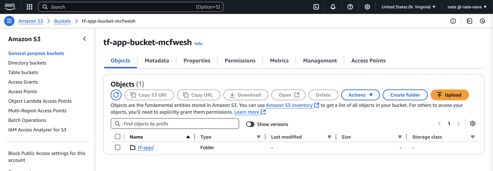
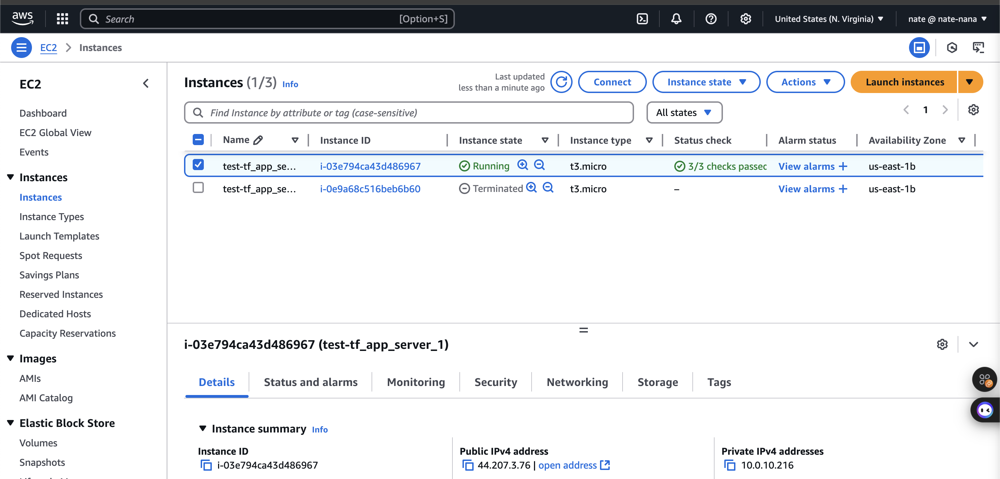
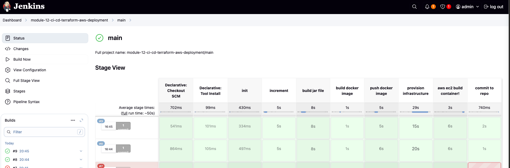

# CI/CD for AWS Infrastructure with Terraform and Jenkins

This project automates the deployment of a scalable application infrastructure on AWS using **Terraform** (infrastructure as code) and **Jenkins** (CI/CD).

## Table of Contents

- [Introduction](#introduction)
- [Project Overview](#project-overview)
- [Implementation Steps](#implementation-steps)
- [Repository Structure](#repository-structure)
- [Key Configuration](#key-configuration)
- [Technologies Used](#technologies-used)
- [Screenshots](#screenshots)

## Introduction

This project aims to streamline the deployment of a web application on AWS by leveraging Infrastructure as Code (IaC) principles using Terraform and a Jenkins CI/CD pipeline.

## Project Overview

The project provisions a VPC, EC2 instances, and deploys Docker containers. It's all managed through Terraform scripts and a Jenkins pipeline, ensuring scalability and reliability. Key AWS services are used for hosting and managing application resources.

## Implementation Steps

1.  **Initialize Terraform:**

    - Set up the Terraform backend.
    - Command: `cd terraform/remote-backend && terraform init`

2.  **Provision Infrastructure:**

    - The Jenkins pipeline's `provision infrastructure` stage applies the Terraform configuration.
    - The `terraformProvisioning` function:
      - Initializes Terraform in `terraform/provisioning`.
      - Applies the Terraform scripts to create AWS resources.
      - Retrieves the EC2 instance's public IP (`terraform output tf_app_server_1_public_ip`) and stores it in the `EC2_PUBLIC_IP` environment variable.

3.  **Build and Push Docker Image:**

    - The Jenkins pipeline's `build docker image` stage builds and pushes the Docker image to the registry.

4.  **Deploy Application:**
    - The Jenkins pipeline's `aws ec2 build container!` stage deploys the application on the EC2 instance.
    - The `deployViaEC2` function:
      - Waits for the EC2 instance to be fully provisioned (waits for the public IP).
      - Uses SSH to copy files (e.g., `docker-compose.yml`, `server-cmds.sh`) to the EC2 instance.
      - Executes the deployment command on the EC2 instance.

## Repository Structure

- **terraform/:** All Terraform configurations for provisioning AWS resources.
  - **terraform/provisioning/:**
    - `main.tf`: Defines infrastructure (VPC, subnets, security groups, EC2 instances).
    - `variables.tf`: Variable definitions (CIDR blocks, IP addresses).
    - `outputs.tf`: Outputs the EC2 instance's public IP.
    - `user-data-script.sh`: Installs Docker on EC2 instances.
  - **terraform/remote-backend/:**
    - `main.tf`: Configures the S3 backend for Terraform state.
- **Jenkinsfile:** Defines the CI/CD pipeline:
  - **Initialization:** Loads the Groovy script.
  - **Version Increment:** Increments the application version.
  - **Build:** Compiles the application (JAR file).
  - **Docker Build:** Builds and pushes the Docker image.
  - **Provision Infrastructure:** Applies the Terraform configuration.
  - **Deploy Application:** Deploys the application on the EC2 instance.

## Key Configuration

- Local private and public keys were added to the Jenkins server Docker container for secure EC2 access. The `.ssh` folder's owner and group were changed to `jenkins:jenkins`.

## Technologies Used

- **Terraform:** Infrastructure provisioning and management.
- **Jenkins:** CI/CD pipeline automation.
- **AWS:** Cloud infrastructure (EC2, S3, VPC).
- **Docker:** Containerizes the application.

## Screenshots

- 
  _AWS S3 bucket for remote state storage._

- 
  _Provisioned EC2 instance configuration._

- 
  _Jenkins pipeline execution stages._
